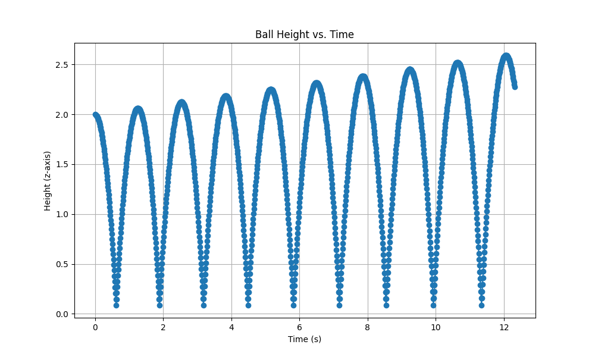
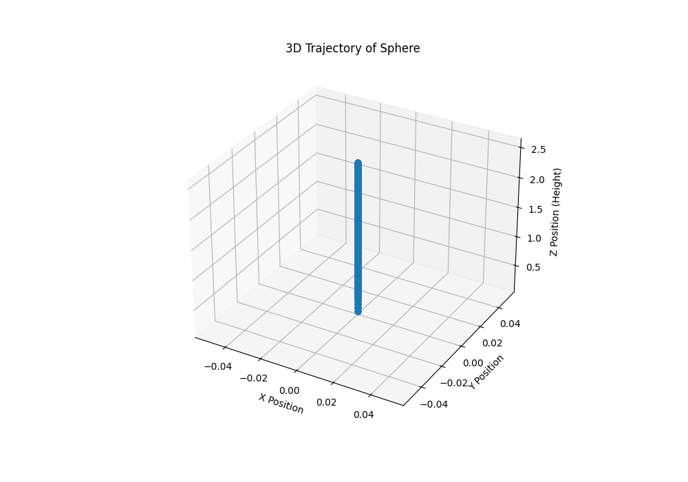
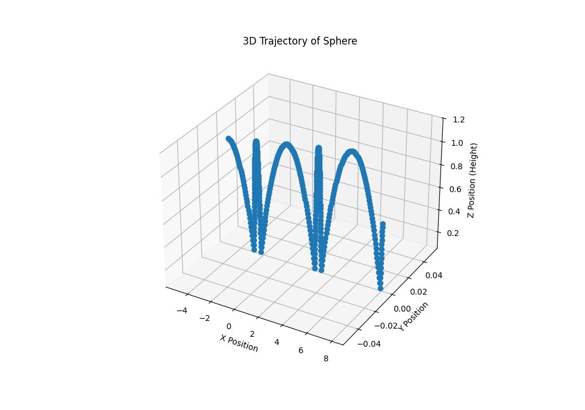
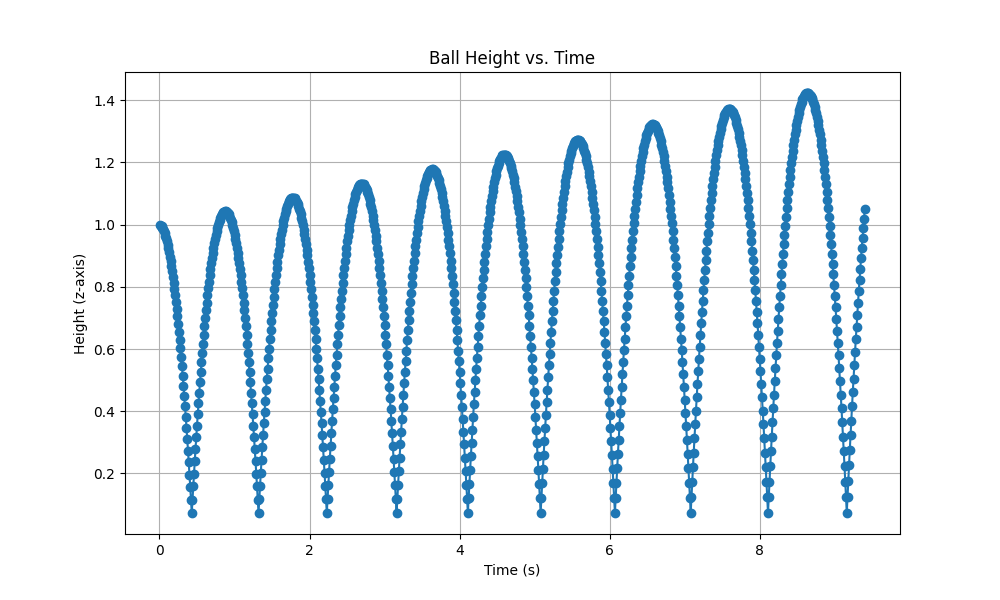
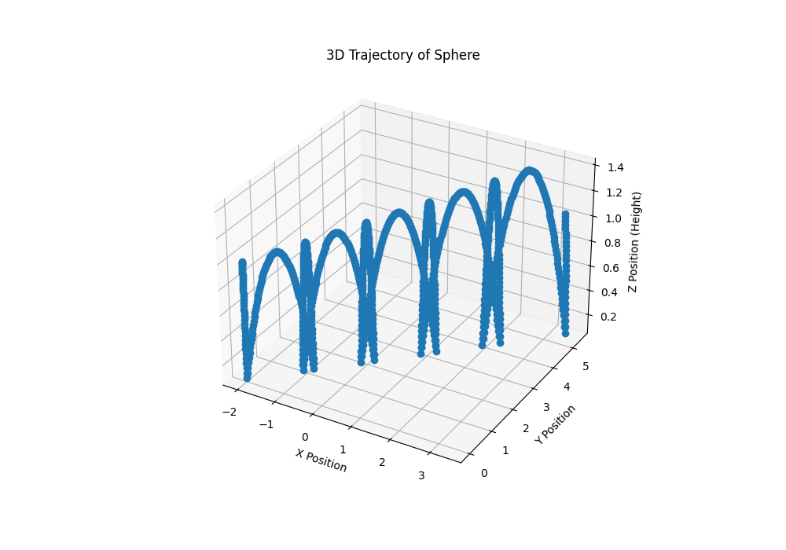
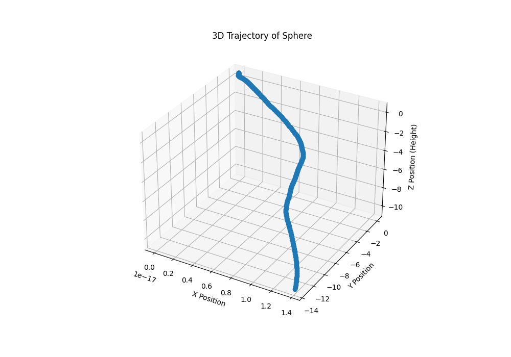
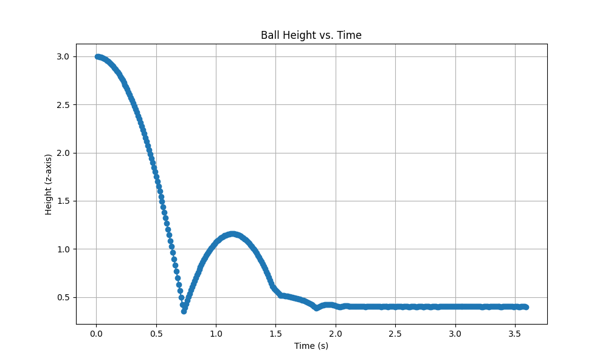
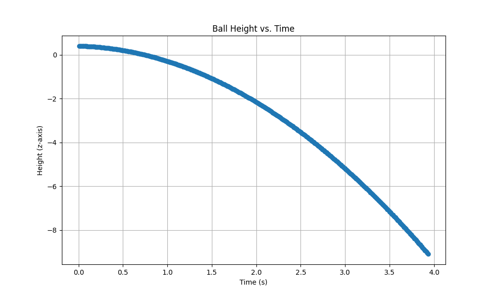

# Rigid Body Simulation Framework using MuJoCo  

## 📑 Table of Contents  
- [Abstract](#abstract)  
- [Simulations](#simulations)  
- [Implementation Details](#implementation-details)  
- [Installation](#installation)  
- [License](#license)  

---

## 📝 Abstract  
This project presents a **customizable rigid body simulation framework** leveraging **MuJoCo** for visualization and XML-based environment descriptions, combined with **impulse-based collision resolution** and **friction modeling** implemented in Python. It supports single and multi-sphere collisions, inclined plane simulations, and comparative analysis with MuJoCo’s built-in solver.  

The framework implements and extends upon the formulations from the paper:  

> **"Nonconvex Rigid Bodies with Stacking"**  
> *PEran Guendelman, Robert Bridson & Ronald Fedkiw (2003)*  

🔗 [Download Paper PDF](./data/Nonconvex_Rigid_Bodies_with_Stacking.pdf)  
📄 DOI: [10.1145/882262.88235](https://doi.org/10.1145/882262.882358)  
📄 [Our Report](./data/report.pdf)  

---

## 🎮 Simulations  

### 1️⃣ Single Sphere Bounce  

These simulations demonstrate a single rigid sphere interacting with a flat ground and inclined surfaces, using impulse-based collision resolution and friction modeling inspired by Guendelman et al.'s formulation.  

---

#### ▶️ (a) Single Sphere Bounce without Initial Velocity  
- **Description:**  
A sphere is dropped from rest, bouncing under gravity. The restitution and friction coefficients determine energy dissipation and rotation after impacts.  

▶️ [Watch Recording](data/recordings/single_sphere/single_sphere_bounce_without_initial_velocity.mp4)  

**Plots:**  
- Height vs Time:  
  

- 3D Trajectory:  
  

---

#### ▶️ (b) Single Sphere Bounce with Only Initial Linear Velocity  
- **Description:**  
The sphere is given an initial horizontal velocity. Friction induces rotational motion over subsequent bounces.  

▶️ [Watch Recording](data/recordings/single_sphere/single_sphere_bounce_with_only_linear_velocity.mp4)  

**Plots:**  
- Height vs Time:  
  

- 3D Trajectory:  
  

---

#### ▶️ (c) Single Sphere Bounce with Only Initial Angular Velocity  
- **Description:**  
A spinning sphere without initial linear velocity interacts with the ground, transferring angular momentum into lateral displacement.  

▶️ [Watch Recording](data/recordings/single_sphere/single_sphere_bounce_with_only_angular_velocity.mp4)  

**Plots:**  
- Height vs Time:  
  

- 3D Trajectory:  
  

---

#### ▶️ (d) Single Sphere Bounce with Both Initial Linear and Angular Velocities  
- **Description:**  
This scenario shows complex motion arising from combined linear and angular initial velocities, highlighting the impulse-based contact model.  

▶️ [Watch Recording](data/recordings/single_sphere/single_sphere_bounce_with_both_velocities.mp4)  

**Plots:**  
- Height vs Time:  
  

- 3D Trajectory:  
  

---

#### ▶️ (e) Single Sphere Rolling and Bouncing on an Incline  
- **Description:**  
A sphere placed on an incline rolls and bounces, demonstrating combined gravitational, frictional, and collision influences.  

▶️ [Watch Recording](data/recordings/single_sphere/sphere_incline_simulation.mp4)  

**Plots:**  
- Height vs Time:  
  

- 3D Trajectory:  
  

---

### 2️⃣ Two-Ball Collision  

This scenario simulates two spheres colliding with predefined initial velocities. The collisions are resolved using impulse-based methods preserving momentum and realistic friction responses.  

▶️ [Watch Recording](data/recordings/ball_collision/two_ball_collision.mp4)  

**Plots:**  
- Combined 3D Collision Trajectory:  
  

- **Ball 1:**  
  - Height vs Time:  
    
  - 3D Trajectory:  
    

- **Ball 2:**  
  - Height vs Time:  
    
  - 3D Trajectory:  
    

---

### 3️⃣ Cube Bouncing and Sliding on Incline  

---

#### ▶️ (a) Cube Bouncing on a Flat Surface  
- **Description:**  
A cube dropped onto a flat plane shows distinct rotational and non-uniform bounce patterns due to its shape and multiple contact edges.  

▶️ [Watch Recording](data/recordings/cube/cube_bounce.mp4)  

**Plot:**  
- Height vs Time:  
  

---

#### ▶️ (b) Cube Sliding Down an Inclined Plane  
- **Description:**  
A cube sliding down an inclined surface demonstrates frictional slip, rotations, and partial rolling, replicating realistic rigid body dynamics.  

▶️ [Watch Recording](data/recordings/cube/cube_incline_simulation_good.mp4)  

**Plots:**  
- Height vs Time:  
  

- 3D Trajectory:  
  

---

## 🛠️ Implementation Details  

### ✅ Key Algorithms and Their Locations:
| Functionality                                | Location                                                        |
|----------------------------------------------|-----------------------------------------------------------------|
| Impulse-based collision resolution (normal & tangential impulses) | `src/physics/collision.py` — functions like `compute_collision_impulse_friction` |
| Friction modeling                            | `src/physics/collision.py` & `src/physics/physics_utils.py`     |
| Custom simulation stepping schemes           | `src/physics/time_integeration.py` & `src/physics/collision.py` |
| Multi-sphere impulse and friction handling   | `src/simulation/multi_sphere_bounce.py`                         |
| Logging of simulation trajectories & plots   | `src/visualization/data_logger.py`, `multi_sphere_logger.py`, and `logger_base.py` |
| MuJoCo simulation viewer, callbacks, and rendering | `src/viewer/mujoco_viewer.py`                                   |
| Centralized config system (per simulation overrides) | `src/config/` (with overrides, camera settings, recording paths, and global defaults) |
| CLI simulation runner                        | `src/simulate.py`                                               |

---

### 📁 Project Directory Structure  

```
RigidBody-Simulation/
│
├── README.md                     # ✅ Project documentation (this file)
├── requirements.txt              # 📦 Python dependencies
├── setup.py                      # ⚙️ Packaging & distribution
├── .gitignore                    # 🚫 Git ignored files
│
├── models/                       # 🏗️ MuJoCo XML models
│   ├── ball_collision.xml        # Two-ball collision scenario
│   ├── multi_sphere.xml          # Multiple spheres bounce setup
│   ├── cube.xml                  # Inclined plane cube model
│   └── sphere.xml                # Single bouncing sphere model
│
├── src/                          # 🚀 Source code
│   ├── simulate.py               # CLI script for running simulations
│   ├── config/                   # ⚙️ Central configuration
│   ├── physics/                  # 📐 Core physics computations
│   ├── simulation/               # 🎥 Simulation scenarios
│   ├── viewer/                   # 👁️ Rendering and visualization handlers
│   └── visualization/            # 📊 Logging and plotting utilities
│
├── data/                         # 🗃️ Simulation output
│   ├── plots/                    # All plots (3D trajectories, height vs. time)
│   ├── recordings/               # Recorded videos of simulations
│   └── report.pdf                # Research paper/report
│
└── tests/                        # ✅ Unit test scripts
```

---

## 🔧 Installation  

### 1️⃣ Install MuJoCo  

Follow the instructions on the official MuJoCo releases page for your OS:  
👉 [MuJoCo Downloads](https://github.com/google-deepmind/mujoco/releases)  

**Summary**:  
- Download and extract MuJoCo for your platform.  
- Set environment variables (if needed) as follows:  
  - **Linux/Mac**:  
    ```bash
    export LD_LIBRARY_PATH=$LD_LIBRARY_PATH:/path/to/mujoco
    export MUJOCO_GL=egl  # Optional for headless
    ```  
  - **Windows**:  
    Add the MuJoCo installation folder to your PATH and set `MUJOCO_GL` if required.  

> Ensure Python >=3.8 is installed.

---

### 2️⃣ Clone & Set Up This Repository  

```bash
git clone https://github.com/Aditya-gam/RigidBody-Simulation.git
cd RigidBody-Simulation
python -m venv venv
source venv/bin/activate    # On Windows: venv\Scripts\activate
pip install -r requirements.txt
```

---

### 3️⃣ Running Simulations  

You can run simulations using the CLI interface:  
```bash
cd src
python simulate.py --sim <simulation_name>
```

Available simulation names:
- `single_sphere`  
- `multi_sphere`  
- `ball_collision`  
- `cube_incline`  
- `compare_builtin`  

Example:
```bash
python simulate.py --sim single_sphere
```

---

### 4️⃣ Customizing Configurations  

All configurations (like restitution, friction, timestep, camera angles) are centralized in `src/config/`.  

- Global defaults are defined in:  
  - `global_sim_params.py`  
- Simulation-specific overrides are defined in:  
  - `sim_overrides.py`  
- Camera settings:  
  - `camera_params.py`  
- Recording paths:  
  - `recording_paths.py`  

Example: To modify gravity or restitution for `cube_incline` simulation, change `sim_overrides.py` under the key `cube_incline`.

---

### 5️⃣ Viewing Outputs  

- 📈 Plots: Located in `data/plots/` organized by simulation type.  
- 🎥 Video recordings: Stored in `data/recordings/` in separate folders for each simulation.

---

## 📜 License  

This project is licensed under the **Apache License 2.0**.  

For full license terms, see the [LICENSE](./LICENSE) file.  
